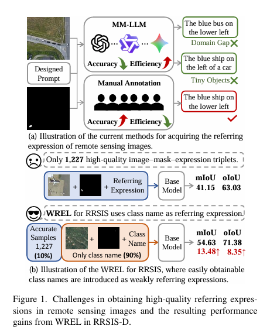
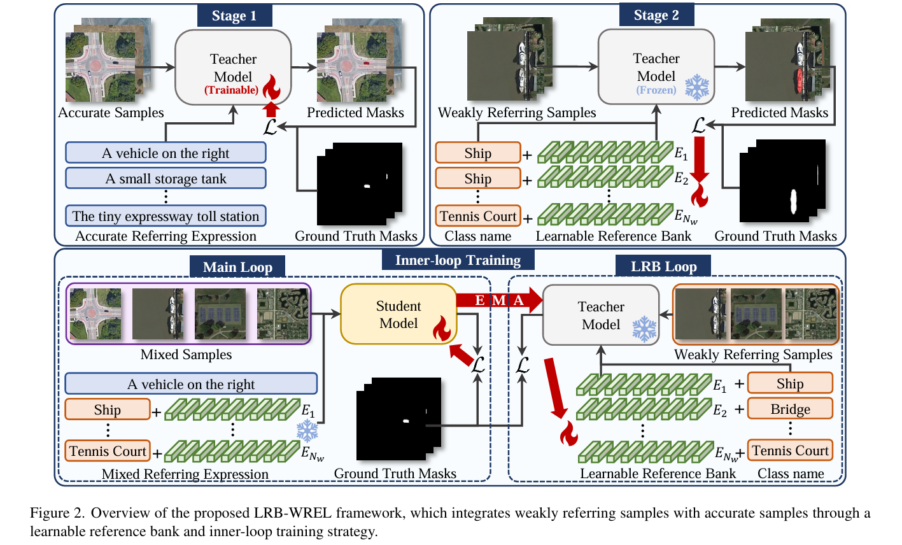
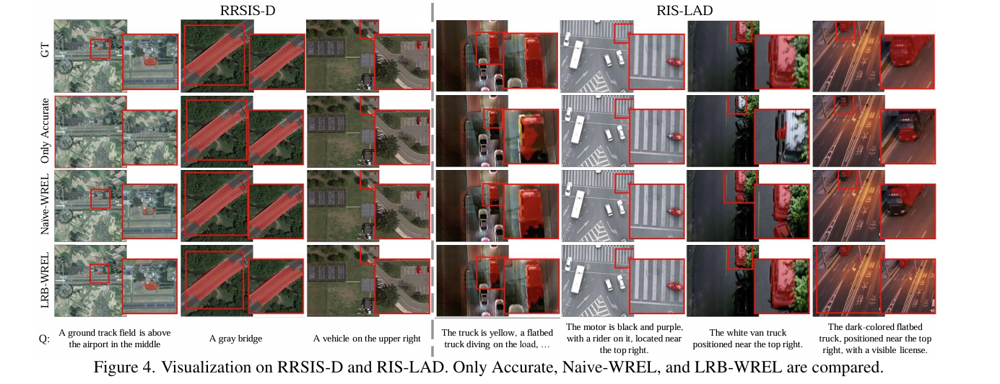

<div align="center">

<h1>🛰️ LRB-WREL</h1>

<h3>Understanding What Is Not Said:Referring Remote Sensing Image Segmentation with Scarce Expressions</h3>

[Kai Ye](https://github.com/yourusername)<sup>1</sup>, [Bowen Liu](https://github.com/yourusername)<sup>1</sup>, [Jianghang Lin](https://github.com/yourusername)<sup>1</sup>, [Jiayi Ji](https://github.com/yourusername)<sup>1,2</sup>, [Pingyang Dai](https://github.com/yourusername)<sup>1</sup>, [Liujuan Cao](https://github.com/yourusername)<sup>1</sup>

<sup>1</sup>Xiamen University, <sup>2</sup>National University of Singapore

<a href="https://arxiv.org/abs/2512.24702"></a>
<a href="https://github.com/yourusername/Evol-SAM3/blob/main/LICENSE"></a>
<a href="https://pytorch.org/"></a>




<p align="center">
  <strong>WREL reformulates RRSIS under limited annotations by incorporating weak class-name referring expressions.</strong><br>
  It substantially improves performance over models trained with limited precise referring expressions only.
</p>

</div>

---

## 🔥 News
* **[2026-01-06]** 🛠️ Codebase for WREL and LRB-WREL, including training and evaluation scripts, is now public.
* **[2025-10-26]** 🚀 Paper is officially released on arXiv. See [here](https://arxiv.org/abs/2510.22760).


---

## 💡 Abstract

Referring Remote Sensing Image Segmentation (RRSIS) aims to segment instances in remote sensing images according to referring expressions. Unlike Referring Image Segmentation on general images, acquiring high-quality referring expressions in the remote sensing domain is particularly challenging due to the prevalence of small, densely distributed objects and complex backgrounds. This paper introduces a new learning paradigm, Weakly Referring Expression Learning (WREL) for RRSIS, which leverages abundant class names as weakly referring expressions together with a small set of accurate ones to enable efficient training under limited annotation conditions. Furthermore, we provide a theoretical analysis showing that mixed-referring training yields a provable upper bound on the performance gap relative to training with fully annotated referring expressions, thereby establishing the validity of this new setting. We also propose LRB-WREL, which integrates a Learnable Reference Bank (LRB) to refine weakly referring expressions through sample-specific prompt embeddings that enrich coarse class-name inputs. Combined with a teacher-student optimization framework using dynamically scheduled EMA updates, LRB-WREL stabilizes training and enhances cross-modal generalization under noisy weakly referring supervision. Extensive experiments on our newly constructed benchmark with varying weakly referring data ratios validate both the theoretical insights and the practical effectiveness of WREL and LRB-WREL, demonstrating that they can approach or even surpass models trained with fully annotated referring expressions.

---

## 🛠️ Methodology

<div align="center">
  
</div>

LRB-WREL Three-Stage Training:
* **Stage 1: Accurate-Referring Pre-training.** Pre-train the segmentation model on a small set of accurate referring expressions to obtain a warm-up teacher.
* **Stage 2: Learnable Reference Bank Initialization.** Introduce a Learnable Reference Bank (LRB) to enrich weakly referring expressions via trainable prompts and attention mask updates, with the teacher frozen.
* **Stage 3: Inner-loop Joint Optimization.** Jointly optimize the student and LRB on a mixed dataset of accurate and LRB-enhanced weak samples, iteratively refining weak referring expressions.

---

## 📊 Performance

We conduct extensive experiments on RRSIS-D and RIS-LAD under varying ratios of accurate-to-weak referring expressions. 
* **Naive-WREL** mixes accurate and weakly referring expressions for training, which already significantly improves segmentation performance over using only accurate expressions. 
* **LRB-WREL** further refines weakly referring expressions with a Learnable Reference Bank and inner-loop optimization, leading to additional gains.

### 🏆 Comparison on RRSIS-D

| Ratio | Method | oIoU Val | oIoU Test | mIoU Val | mIoU Test |
|-------|--------|----------|-----------|----------|-----------|
| 100%  | RMSIN | 78.27 | 77.79 | 65.10 | 64.20 |
| 10%   | Only Accurate | 62.56 | 63.03 | 41.34 | 41.15 |
|       | Naive-WREL (ours) | 69.95 | 71.48 | 54.15 | 54.63 |
|       | LRB-WREL (ours) | **72.27** | **71.70** | **56.87** | **56.32** |
| 30%   | Only Accurate | 73.62 | 72.34 | 55.18 | 54.07 |
|       | Naive-WREL (ours) | 73.24 | 74.28 | 57.77 | 58.19 |
|       | LRB-WREL (ours) | **75.80** | **74.32** | **60.13** | **58.79** |
| 50%   | Only Accurate | 75.65 | 73.51 | 59.42 | 56.18 |
|       | Naive-WREL (ours) | 76.15 | 76.50 | 61.31 | 61.42 |
|       | LRB-WREL (ours) | **76.42** | **76.57** | **62.69** | **62.08** |

<br>

### 📈 Comparison on RIS-LAD

| Ratio | Method | oIoU Val | oIoU Test | mIoU Val | mIoU Test |
|-------|--------|----------|-----------|----------|-----------|
| 100%  | RMSIN | 50.17 | 48.82 | 42.08 | 39.60 |
| 10%   | Only Accurate | 14.33 | 13.69 | 9.04  | 8.32  |
|       | Naive-WREL (ours) | 25.74 | 26.10 | 18.88 | 16.90 |
|       | LRB-WREL (ours) | **27.24** | **28.13** | **22.20** | **21.05** |
| 30%   | Only Accurate | 33.49 | 33.17 | 23.30 | 22.07 |
|       | Naive-WREL (ours) | 34.76 | 34.71 | 28.49 | 26.04 |
|       | LRB-WREL (ours) | **36.10** | **35.11** | **30.20** | **28.42** |
| 50%   | Only Accurate | 39.08 | 37.34 | 30.53 | 27.35 |
|       | Naive-WREL (ours) | 38.43 | 39.14 | 30.54 | 28.68 |
|       | LRB-WREL (ours) | **40.29** | **39.59** | **33.06** | **30.36** |


---

## 🖼️ Qualitative Results

<div align="center">
  
</div>

Visualization shows that **Naive-WREL** improves segmentation quality over the baseline, and **LRB-WREL** further enhances boundary accuracy and weakly referring expression segmentation.

---

## 🚀 Quick Start

### Setting Up
The environment setup (Python, PyTorch, dependencies, MMCV, Deformable Attention compilation, pretrained weights, etc.) is **exactly the same as the original [RMSIN repository](https://github.com/Lsan2401/RMSIN)**.  Please follow the official RMSIN README for all installation steps.


### Datasets
We perform all experiments on dataset RRSIS-D. RRSIS-D is a new Referring Remote Sensing Image Segmentation benchmark which containes 17,402 image-caption-mask triplets.
#### Usage
1. Download image from RRSIS-D.
2. Format all files to `./refer/data/`. The dataset folder should be like this:
```
├──rrsisd-90-all
│   ├── rrsisd
│    │   ├── refs(unc).p
│    │   ├── instances.json
│    └── images
│        └── rrsisd
│            ├── JPEGImages
│            ├── ann_split
├──rrsisd-90-no-mask
│   ├── ...
├──rrsisd-90-mask
│   ├── ...
```
3. We provide the script `mask_train_only.py` to create masked variants of the training set. Only the train split is modified; the val/test splits remain unchanged. For each masking ratio, the script generates six files:
- `instances-XX-no-mask.json` / `refs(unc)-XX-no-mask.p`
- `instances-XX-mask.json` / `refs(unc)-XX-mask.p`
- `instances-XX-all.json` / `refs(unc)-XX-all.p`  
These provide three complementary views of the same modified training split, corresponding to:
- **mask**: only the masked samples  
- **no-mask**: only the unmasked samples  
- **all**: full training data (masked + unmasked)  
These files together form the masked dataset versions under different masking levels.  
4. Example:
For experiments using **10% accurate references**, we should use the **90% masking** results, i.e., the files:
- `instances-90-{all, no-mask, mask}.json`  
- `refs(unc)-90-{all, no-mask, mask}.p`  
These serve as the dataset inputs for the 10% accuracy setting. After placing these files into the corresponding dataset directory, they should be renamed to `instances.json` and `refs(unc).p` to ensure the experiments run correctly. 
5. The `./rrsisd-mask` folder already contains the masking JSON and `.p` files, which serve as examples for constructing datasets with partially accurate references. This folder will also be compressed separately.
   
### Training
Experiments are conducted in three stages. Only a 10% accurate reference data example is shown; other splits can be configured similarly.
We use DistributedDataParallel from PyTorch for training. To run on 4 GPUs (with IDs 0, 1, 2, and 3) on a single node.

WREL
```shell
CUDA_VISIBLE_DEVICES=0,1,2,3 torchrun --nproc_per_node=4 --master_port=12345 train.py --dataset rrsisd --model_id RMSIN --refer_data_root $DATA_PATH_all --epochs 40 --img_size 480 --lr 3e-5 2>&1 | tee ./output
```

LRB-WREL

Stage 1: Warm-up Teacher Model (RMSIN-Only Accurate)
```shell
CUDA_VISIBLE_DEVICES=0,1,2,3 torchrun --nproc_per_node=4 --master_port=12345 train.py 
    --dataset rrsisd --model_id RMSIN --refer_data_root $DATA_PATH_no_mask 
    --epochs <warmup_epochs> --img_size 480 --lr 3e-5 
    2>&1 | tee ./logs/stage1_teacher.log
```

Stage 2: Warm-up LRB
```shell
CUDA_VISIBLE_DEVICES=0,1,2,3 torchrun --nproc_per_node=4 --master_port=12345 train_stu_base.py --dataset rrsisd --model_id RMSIN --refer_data_root $DATA_PATH_mask --epochs 40 --img_size 480 --resume $RMSIN-Only Accurate/model_epoch_15.pth --lr 1e-5 2>&1 | tee ./output
```

Stage 3: Full LRB-WREL Training
```shell
CUDA_VISIBLE_DEVICES=0,1,2,3 torchrun --nproc_per_node=4 --master_port=12345 train_stu_tea_base_true_with_right_lr.py --dataset rrsisd --model_id RMSIN --refer_data_root $DATA_PATH_all --epochs 40 --img_size 480 --lr 2e-5 --caption_lr 1e-6 --caption_inner_steps 1 --caption_update_every 1 --resume $RMSIN-Only Accurate/model_epoch_15.pth --caption_embedding_path $LRB-WREL/caption_embeddings_RMSIN.pt 2>&1 | tee ./output

```


### Testing
```shell
python test.py --swin_type base --dataset rrsisd --resume ./your_checkpoints_path --split test --workers 4 --window12 --img_size 480
```


## 📝 Citation

If you find our work helpful, please consider citing:

```bibtex
@misc{ye2025understandingsaidreferringremotesensing,
      title={Understanding What Is Not Said:Referring Remote Sensing Image Segmentation with Scarce Expressions}, 
      author={Kai Ye and Bowen Liu and Jianghang Lin and Jiayi Ji and Pingyang Dai and Liujuan Cao},
      year={2025},
      eprint={2510.22760},
      archivePrefix={arXiv},
      primaryClass={eess.IV},
      url={https://arxiv.org/abs/2510.22760}, 
}